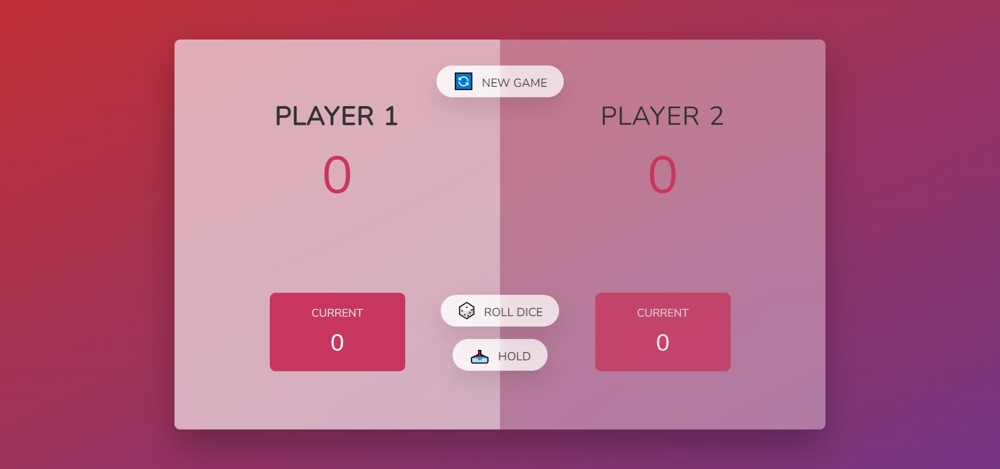

# About The Project

Dice game with Javascript DOM manipulation. Two players take turns to roll the dice. The sum of the dice rolled is added to the total score. The player who scores the number 1 loses turn. The turn passes to the other player. The first player to reach 100 points wins the game.

## Images

### Home Page

## Start The Project

The game can be played by opening the index.html file.

## Languages and Libraries

<li>HTML
<li>CSS
<li>Javascript

## Contact

Oğuz Adıgüzel [Linkedin](https://www.linkedin.com/in/oğuz-adıgüzel-2672a8242). - oguz_adiguzel@outlook.com

Project Link : [https://github.com/oguz-adiguzel/Javascript-DOM-Project-2](https://github.com/oguz-adiguzel/Javascript-DOM-Project-2).

Vercel Link : [https://dice-game-sage.vercel.app](https://dice-game-sage.vercel.app)